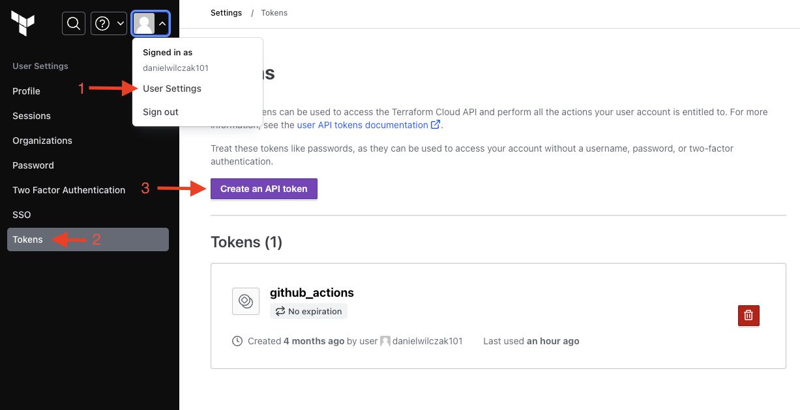
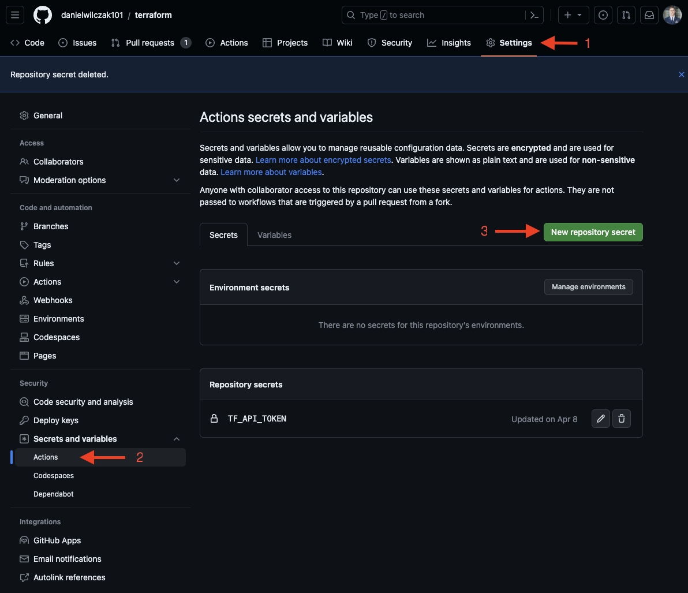
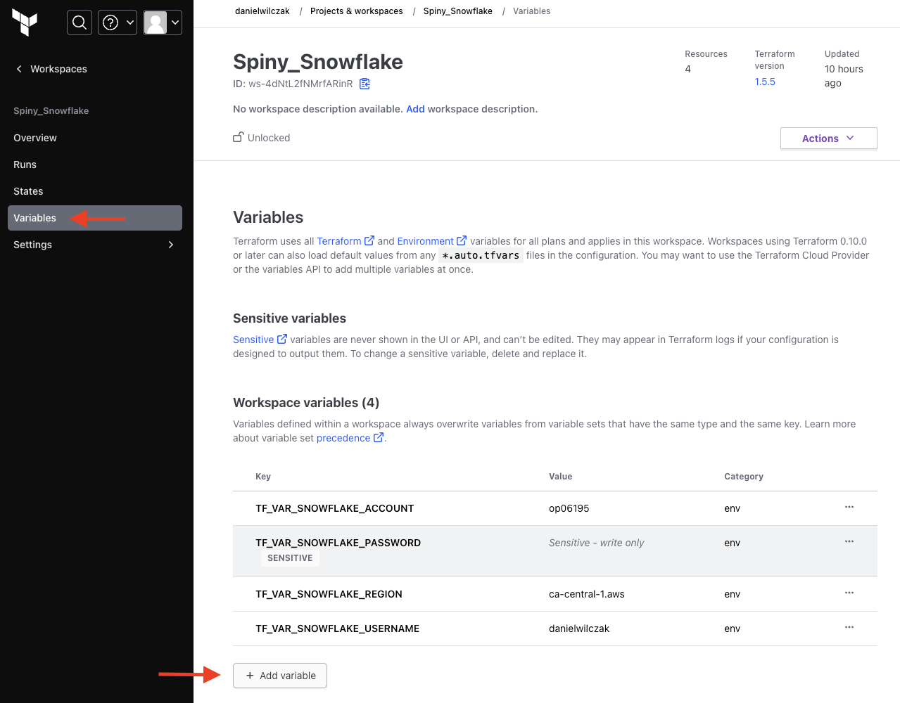

# Terraform connected to snowflake
My goal with this repo is to learn more about terraform/snowflake to provide "code as infrustructure".

### Current code:
Shows how users can build snowpark procedures using terraform to git control snowpark models and infrastructure.

To see how branching works, check out the [PR example](https://github.com/danielwilczak101/terraform/pull/5) that checks the changes also known as a plan in terraform during the PR process.

## Setup

**Resources:**
1. Sign up for [snowflake](https://signup.snowflake.com/) account.
2. Sign up for [terraform cloud](https://www.terraform.io/) account.
3. Sign up or create a new repo on [github](https://github.com/).

**Tutorial:**
1. Create an API token from terraform:


2. Add the API token to Github.

  
3. Get your snowflake account information needed for terraform.
Create a sql worksheet:
```sql
select 
    current_user() as TF_VAR_SNOWFLAKE_USERNAME,
    current_account() as TF_VAR_SNOWFLAKE_ACCOUNT,
    current_region() as TF_VAR_SNOWFLAKE_REGION,
    '****' as TF_VAR_SNOWFLAKE_PASSWORD
```

4. Create a terraform orginization.
5. Create a workspace.

6. Add the snowflake account information to your workspace variables.


7. Clone the repository or download via zip file to your own github repo.

8.  Modify the ``main.tf`` file and add your own orginization and workspace name.

**IMPORTANT**
9. You must create your database before you your create any other resources or else the github action will fail.

Run first:
```json
resource "snowflake_database" "db" {
  name    = "SPINY_DB"
  comment = "Demo to show kyle you can git control snowflake procedure for ML models."
}
```

Then run:
```json

resource "snowflake_database" "db" {
  name    = "SPINY_DB"
  comment = "Demo to show kyle you can git control snowflake procedure for ML models."
}

resource "snowflake_schema" "schema" {
  database = "SPINY_DB"
  name     = "ML_MODELS"
  comment  = "A schema that stores all data related to our machine learning models."
}

resource "snowflake_warehouse" "warehouse" {
  name           = "SNOWPARK_OPT_WH"
  warehouse_size = "MEDIUM"
  warehouse_type = "SNOWPARK-OPTIMIZED"
}

resource "snowflake_procedure" "proc" {
  name     = "SAMPLE_PROC"
  database = snowflake_database.db.name
  schema   = snowflake_schema.schema.name
  language = "PYTHON"
  runtime_version = "3.8"
  comment             = "Creates a stored procedure that trains a linear regression model"
  return_type         = "VARIANT"
  packages = ["snowflake-snowpark-python", "scikit-learn", "joblib"]
  handler = "main"
  statement           = <<EOT
import os
from sklearn.compose import ColumnTransformer
from sklearn.pipeline import Pipeline
from sklearn.preprocessing import PolynomialFeatures
from sklearn.preprocessing import StandardScaler
from sklearn.linear_model import LinearRegression
from sklearn.model_selection import train_test_split, GridSearchCV
from joblib import dump

def main(session):
  # Load features
  df = session.table('MARKETING_BUDGETS_FEATURES').to_pandas()
  X = df.drop('REVENUE', axis = 1)
  y = df['REVENUE']

  # Split dataset into training and test
  X_train, X_test, y_train, y_test = train_test_split(X, y, test_size=0.2, random_state = 42)

  # Preprocess numeric columns
  numeric_features = ['SEARCH_ENGINE','SOCIAL_MEDIA','VIDEO','EMAIL']
  numeric_transformer = Pipeline(steps=[('poly',PolynomialFeatures(degree = 2)),('scaler', StandardScaler())])
  preprocessor = ColumnTransformer(transformers=[('num', numeric_transformer, numeric_features)])

  # Create pipeline and train
  pipeline = Pipeline(steps=[('preprocessor', preprocessor),('classifier', LinearRegression(n_jobs=-1))])
  model = GridSearchCV(pipeline, param_grid={}, n_jobs=-1, cv=10)
  model.fit(X_train, y_train)

  # Upload trained model to a stage
  model_file = os.path.join('/tmp', 'model.joblib')
  dump(model, model_file)
  session.file.put(model_file, "@ml_models",overwrite=True)

  # Return model R2 score on train and test data
  return {"R2 score on Train": model.score(X_train, y_train),"R2 score on Test": model.score(X_test, y_test)}
EOT
}

```